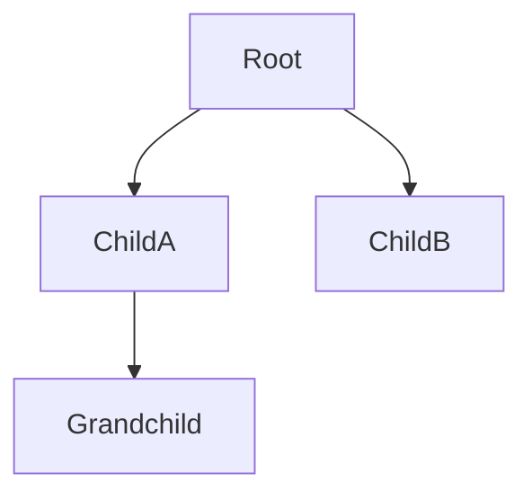

# mermaid-diagrams

## Behavioral Classification

**Type**: Autonomous Execution

**Directive**: EXECUTE, DON'T ASK

When a diagram would help the user, produce a mermaid fenced code block immediately. Do not ask which diagram type to use — pick the best one from the selection guide below. Do not ask whether mermaid is acceptable — it always is in this project.

## Core rule

When a diagram would clarify something, emit a fenced mermaid block:

````

````

**Never** use ASCII art or Unicode box-drawing for structural diagrams. The following characters are forbidden in diagrams: `+---+`, `│`, `─`, `┌`, `┐`, `└`, `┘`, `├`, `┤`, `┬`, `┴`, `┼`.

Indented bullet lists that pretend to be trees or hierarchies are also forbidden when the intent is a structural diagram — use `flowchart TD` instead.

## Diagram-type selection guide

Pick the mermaid type that matches the intent. Do not default to `flowchart` for everything.

| Intent | Mermaid type |
|---|---|
| Process, pipeline, decision flow | `flowchart LR` or `flowchart TD` |
| Interaction between actors/services over time | `sequenceDiagram` |
| State machine, lifecycle | `stateDiagram-v2` |
| Data model, tables and relations | `erDiagram` |
| Class hierarchy, OO structure | `classDiagram` |
| Schedule, timeline | `gantt` |
| Dependency tree, org chart | `flowchart TD` |
| Git branching | `gitGraph` |

For a fuller explanation of each type and when to use it, see `references/diagram-types.md`. For copy-pasteable examples of each type, see `references/examples.md`.

## The only exception: file and directory trees

Actual filesystem listings (the output of `tree`, or a proposed directory layout) are allowed to use ASCII tree drawing because mermaid doesn't render them well. Example of an **allowed** exception:

```
.claude/skills/mermaid-diagrams/
├── SKILL.md
├── README.md
├── CHANGELOG.md
└── references/
    ├── diagram-types.md
    └── examples.md
```

This exception applies **only** to filesystem layouts. Everything else structural — architectures, workflows, data models, state machines — must be mermaid.

## Anti-patterns

**Do not do this** (ASCII boxes):

```
+--------+      +--------+
| Client | ---> | Server |
+--------+      +--------+
```

**Do this instead**:

````

````

**Do not do this** (indented bullets pretending to be a tree):

```
- Root
  - Child A
    - Grandchild
  - Child B
```

When the intent is a structural/dependency diagram, **do this instead**:

````

````

(Bulleted lists are still fine for actual lists of items — the anti-pattern is using them as a substitute for a real diagram.)

## Quick defaults

- If unsure which type to pick, read `references/diagram-types.md`.
- If unsure about syntax, read `references/examples.md`.
- If the user's request is ambiguous about direction, default to `LR` for flowcharts (reads left-to-right like prose).
