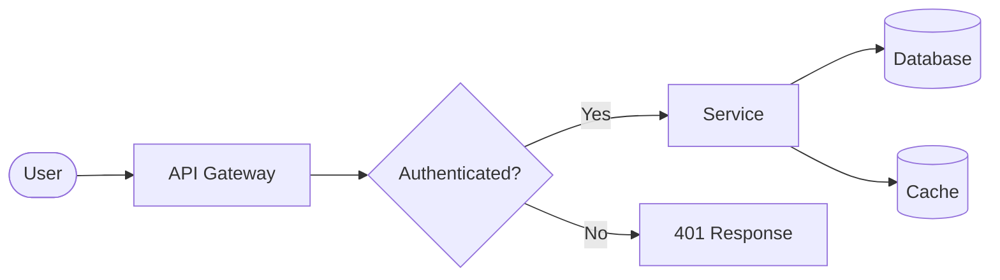
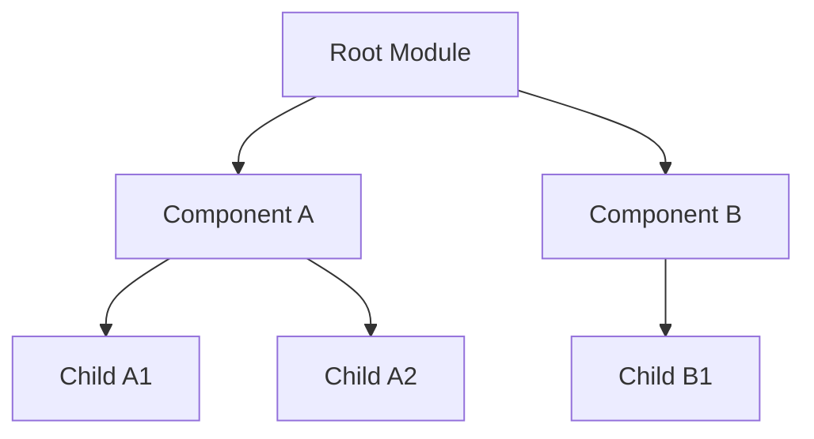
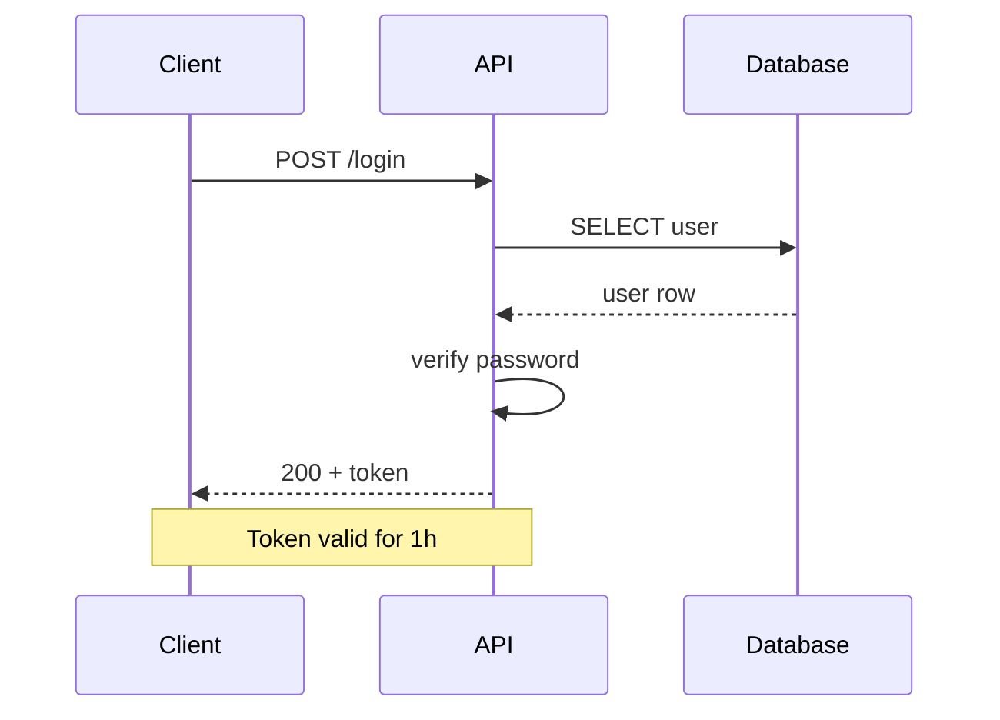
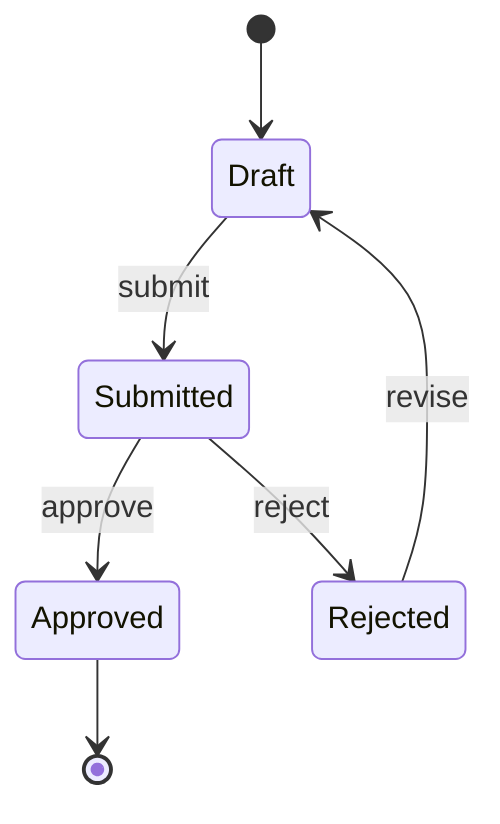
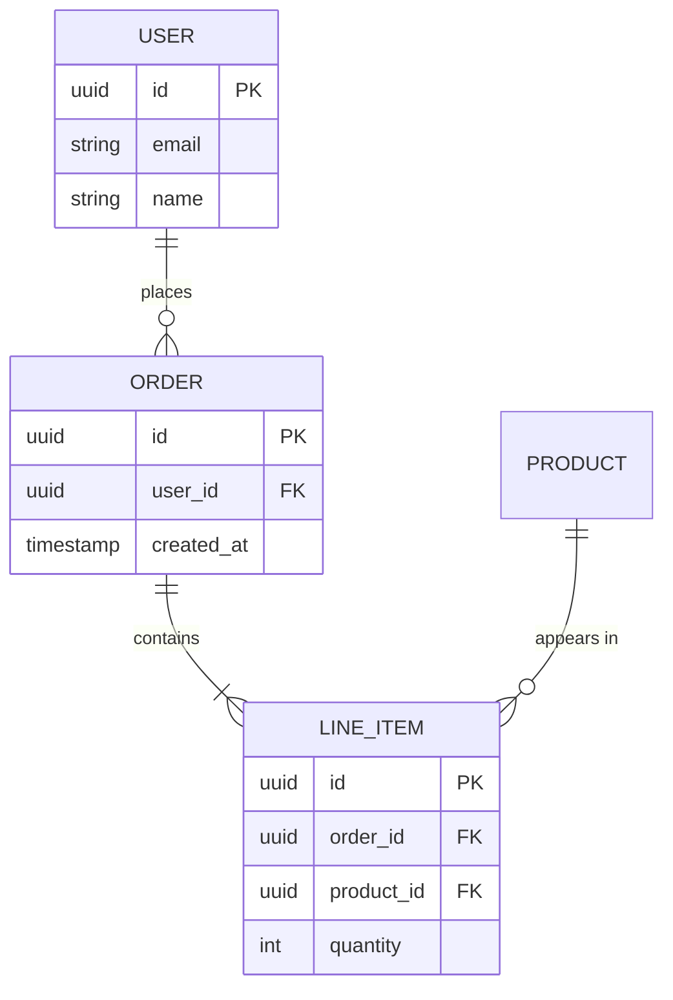
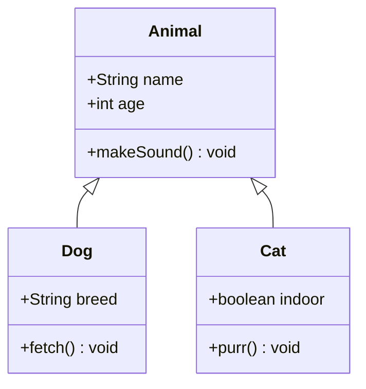
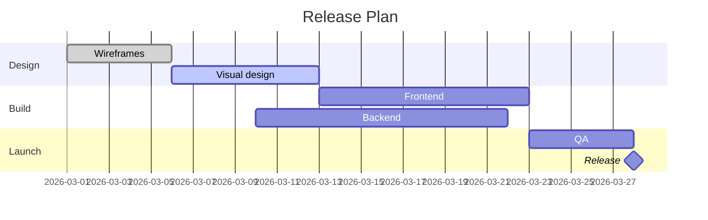
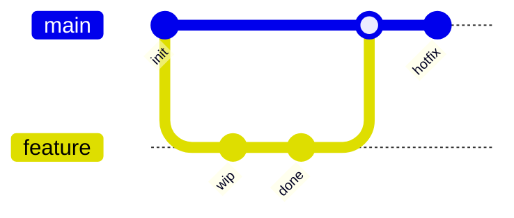

# Mermaid examples

Copy-pasteable starting points for each supported diagram type. Adapt labels and shapes to the actual subject.

## flowchart (LR)

## flowchart (TD) — for hierarchies

## sequenceDiagram

## stateDiagram-v2

## erDiagram

## classDiagram

## gantt

## gitGraph

## Cheatsheet: common tweaks

- **Direction**: `flowchart LR|TD|BT|RL`
- **Label an edge**: `A -->|label| B`
- **Dashed edge**: `A -.-> B`
- **Thick edge**: `A ==> B`
- **Subgraphs**: `subgraph name ... end`
- **Comments**: `%% this is a comment`
